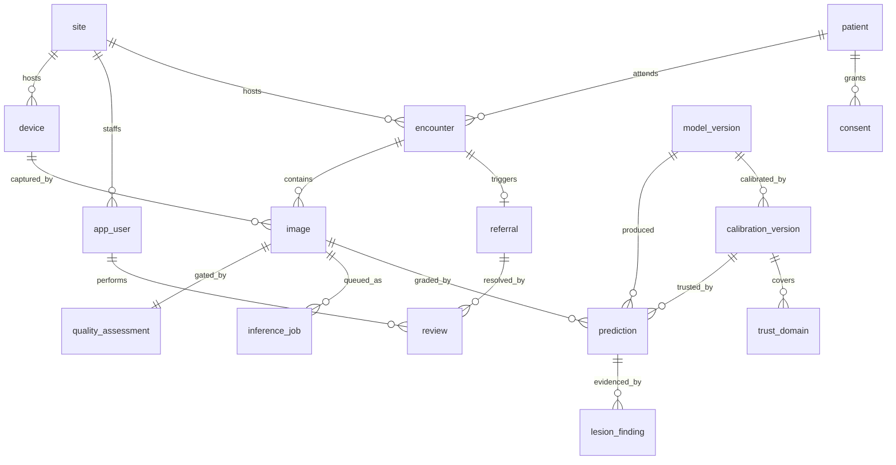

# Certus backend — data model (demo build)

Design rules:

1. **Every clinical output is reproducible.** A prediction points at the exact model
   version *and* calibration version that produced it. Re-calibrating never rewrites history.
2. **Hardware independence.** Inference is ONNX Runtime on CPU; a GPU is used only if present.
   Nothing in the schema assumes a local GPU, a local filesystem, or a single machine.
3. **The audit log is append-only and hash-chained.** A screening record that can be edited
   silently is worthless for a regulated device.
4. **Abstention is a first-class outcome**, not a null. "The model refused to guess" is a
   recorded decision with a reason.
5. **Minimal PII.** Demo stores a pseudonymous patient key; ABHA id and phone are hashed.

## Entities

| Table | Holds | Key relationships |
|---|---|---|
| `site` | Camp / clinic / PHC | 1-N `device`, `encounter` |
| `device` | Camera (make, model, serial) | N-1 `site`; `domain_key` -> `trust_domain` |
| `app_user` | Technician, ophthalmologist, admin | N-1 `site` |
| `patient` | Pseudonymous subject; hashed ABHA/phone | 1-N `encounter`, `consent` |
| `consent` | ABDM consent grant/revoke, scope, artifact ref | N-1 `patient` |
| `encounter` | One screening visit | N-1 `patient`, `site`, `app_user`; 1-N `image` |
| `image` | One fundus photo, sha256-addressed | N-1 `encounter`, `device`; 1-1 `quality_assessment` |
| `inference_job` | Queue row: state, attempts, runtime, executor used | N-1 `image` |
| `quality_assessment` | Gate verdict: good / usable / reject + probs | N-1 `image`, `model_version` |
| `prediction` | Eye-level grade: ordinal probs, calibrated referable prob, decision, threshold, evidence vector, tile attention | N-1 `image`, `model_version`, `calibration_version` |
| `lesion_finding` | Per lesion type: threshold used, pixel area, count, per-quadrant counts, overlay URI | N-1 `prediction` |
| `model_version` | Trained network: git sha, ONNX URIs, input spec, training metrics | 1-N `calibration_version` |
| `calibration_version` | Temperature, grade threshold, per-lesion thresholds, conformal quantiles, fit provenance | N-1 `model_version`; 1-N `trust_domain` |
| `trust_domain` | Per-camera/domain reliability: n, AUC, ECE, abstain rate, status | N-1 `calibration_version` |
| `referral` | Queue item with priority + SLA deadline | N-1 `encounter`; 1-N `review` |
| `review` | Ophthalmologist verdict, agreement, time spent | N-1 `referral`, `app_user` |
| `audit_log` | Append-only hash chain of every state change | polymorphic entity ref |

## Diagram

## Decisions worth defending

- **`prediction` is per image (one eye, one field), `referral` is per encounter.** A patient is
  referred once, at the severity of their worst eye; graders read each eye separately.
- **Thresholds live in `calibration_version`, never in code.** The 0.127 referral cut-off and the
  per-lesion cut-offs (microaneurysms ~0.02, exudates ~0.78) are data, fitted on held-out images.
- **`trust_domain.status` gates the UI.** An unseen camera is reported as lower trust instead of
  being silently graded with thresholds fitted elsewhere.
- **Images are content-addressed by sha256**, so re-uploading the same photo is idempotent and
  storage can move to S3 later without touching the schema.
