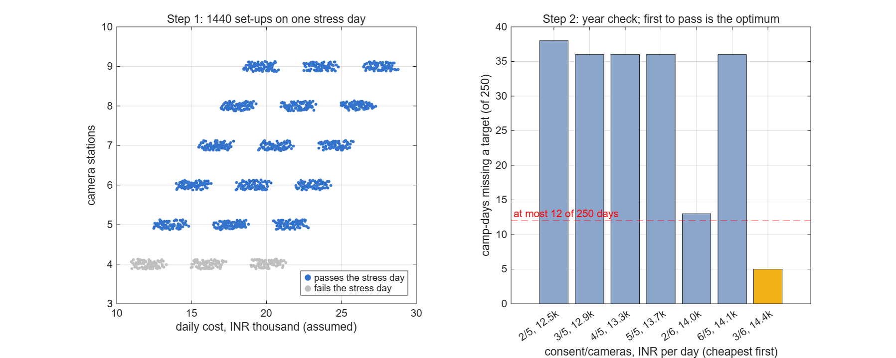

# Certus district screening capacity model

`certus_screening.slx` is a capacity-planning model of a district-level
diabetic-retinopathy (DR) screening programme for the Certus project
(SIH 2026 PS 26038). It answers the question the problem statement
actually asks: *to screen 100,000+ patients a year in a district, how
many ophthalmologist-hours and how much hardware are needed?*

It is **not** a per-patient discrete-event simulation. It is a
fluid/rate-based (continuous-flow) queueing model: every pipeline stage
tracks a *rate* of patients/minute and a *queue level* in patients, at a
1-minute fixed step, over one representative camp-day (08:00 camp open,
13 h total simulated window including an evening tele-review buffer).
Annual/district figures are obtained by scaling the one-camp-day result
by `camp_days_per_year` (see `certus_params.m`).

## Files

| File | Purpose |
|---|---|
| `certus_params.m` | Every parameter, with units and a source comment on every line. **Read this first.** |
| `build_certus_screening.m` | Builds `certus_screening.slx` programmatically (`new_system`/`add_block`/`add_line`/`set_param`) and runs a smoke-test `sim()` before saving. |
| `certus_screening.slx` | The built model (regenerate any time with `build_certus_screening`). |
| `run_certus_screening.m` | Runs the model across scenarios, prints the summary table, saves figures. |
| `run_certus_optimise.m` | **Resource optimiser**: exhaustive screen of 1,440 camp set-ups on a stress day, then a chance-constrained check over 250 simulated camp-days. Saves `optimise_results.mat` and `fig_optimisation.png`. |
| `certus_metrics.m` | The headline numbers for one simulated day, shared by both scripts. |
| `fig_base_case_timeseries.png`, `fig_power_outage.png`, `fig_staffing_sweep.png` | Output figures from the last `run_certus_screening` run. |

## How to open and run

From `D:\Certus\matlab\simulink`, headless (MATLAB is on the D: drive,
not on PATH):

```bash
"/d/MATLAB/R2026a/bin/matlab.exe" -batch "build_certus_screening"   # (re)builds + smoke-tests the .slx
"/d/MATLAB/R2026a/bin/matlab.exe" -batch "run_certus_screening"     # runs all scenarios, prints table, saves figures
```

Or interactively: `open_system('certus_screening')` after `cd`-ing into
this folder, then run `run_certus_screening` from the MATLAB command
window to populate the base workspace `p` struct and simulate.

## Why discrete-time Simulink, not SimEvents

The task asked for SimEvents where practical. SimEvents was checked
first:

- `license('test','SimEvents')` returned `1` (licensed) and `ver` listed
  `SimEvents Version 26.1 (R2026a)` — looked installed.
- But `D:\MATLAB\R2026a\toolbox` has **no** `simevents` directory, there
  is no `simevents*.slx`/library anywhere on disk, and
  `add_block('simevents/Entity Generator', ...)` fails with *"There is
  no block named 'simevents/Entity Generator'"*.

This is a broken/incomplete `mpm` install (license metadata present,
toolbox payload absent), not a licensing restriction. Per the task's own
fallback instruction ("if SimEvents blocks prove too difficult to wire
programmatically... fall back to a plain discrete-time Simulink
formulation"), this model uses that fallback: each pipeline stage is a
**Unit Delay** holding the queue level (the required discrete-time
"integrator" state, fed back to itself every step) plus a **MATLAB
Function** block computing that step's served/lost/next-queue values
from (queue, arrival rate, capacity rate, pass fraction, power gate, dt).

Stateflow **is** actually present on disk (`toolbox/stateflow` exists)
and works correctly, and is used for the camp power state machine as
required (see below) — confirmed by driving a 5 h simulated outage and
observing the battery discharge from full to empty over exactly its
configured 4 h capacity, entering the `OFFLINE` state, then returning to
`GRID` when the outage ends.

## Model structure

```
Clock -> ArrivalProfile (trapezoid session shape)
                |
                v
[Consent] -> [Capture] -> [Quality gate+retake] -> [Edge inference] -> [Band decision]
   |dropout      |            |ungradable loss                          |    |    |
   v             v             v                                     clear refer abstain
  lost          (queue)       lost                                     |      \    /
                                                                        |    [Ophth review queue]
                                                                        |         | served
                                                                        v         v
                                                                     [Sum] -> [Upload] -> screened
                                                                                  |
                                                                                 lost (link failure)

Stateflow "CampPower": GRID --[~grid_avail]--> BATTERY --[battery<=0]--> OFFLINE
                          ^-----------[grid_avail]-------------|            |
                          ^--------------------------[grid_avail]-----------|
power_on gates every stage's capacity (capacity_count = capacity_rate * power_on * dt).
```

Each queueing stage (`*_fcn` MATLAB Function blocks + `*_Q` Unit Delay
blocks) implements:

```
available      = queue_prev + arrival_rate*dt
attempt        = min(available, capacity_rate*power_on*dt)
served         = attempt * pass_frac
lost           = attempt * (1-pass_frac)
queue_next     = available - attempt      % fed back into the Unit Delay
```

The **screening-band decision** and **ophthalmologist-capacity blend**
are pure MATLAB Function blocks (no queue of their own — the decision is
effectively instantaneous; the queueing happens downstream in the
ophthalmologist-review stage).

The **ophthalmologist queue** uses a single shared FCFS server pool for
both auto-referred cases (30 s confirm) and abstained cases (90 s manual
grade), with a per-step blended service time weighted by the current
mix of arriving referrals vs. abstentions (`OphthCapacity` block). This
is a documented simplification vs. two priority-scheduled queues — see
Limitations.

## Parameters and sources (summary — full detail with citations in `certus_params.m`)

| Parameter | Base value | Source |
|---|---|---|
| Screening-band abstain rate (in-distribution) | 11.75% | **Measured.** `D:\Certus\runs_torch\train_20260912_211356\trust.json` → `screening_band.measured.test.abstain_rate` |
| Screening-band abstain rate (unseen camera / external) | 26.44% | **Measured.** Same file → `screening_band.measured.external_messidor2.abstain_rate` |
| Edge inference time | 2.0 s/eye | Task brief: measured 1.0–2.9 s/eye on RTX 3050 laptop GPU, ~couple sec on CPU. Base case; tunable. |
| Ungradable/quality-fail rate | 7% | Task brief's 4–10% band for Certus (which has a quality gate), between field figures of 22.5% (SMART India, no quality handling), 21% (Thailand clinic), ~4% (handheld + trained operator) — all cited in `D:\Certus\sim\parameters.md`. |
| Ophthalmologist time, AI-assisted confirm | 30 s | `sim/parameters.md`, itself citing the problem-statement <30s validation target. |
| Ophthalmologist time, full manual grade | 90 s | `sim/parameters.md` (assumption there, swept 45–180s). |
| Consent (ABDM OTP) time / failure rate | 2 min / 5% | `sim/parameters.md`. |
| Capture time (both eyes) | 5 min | `sim/parameters.md` (assumption, swept 3–8 min there). |
| Rural grid availability | 22.6 h/day (context) | PIB/Ministry of Power, Feb 2025, cited in `sim/parameters.md`. |
| Outage frequency | ≥1/day for 2/3 of rural households (context) | CEEW/Prayas, cited in `sim/parameters.md`. |
| Referable-DR share among non-abstained | 8% (assumption) | Between VTDR (4.0%) and any-DR (12.5%) prevalence, SMART India / Lancet Glob Health 2022, matching `sim/parameters.md`'s own 8% assumption. |
| District target | 100,000 patients/yr | SIH 26038 problem statement. |
| Camp days/year, patients/camp-day | 250 days, 400/day | Derived: 100,000/250. |

Every other parameter (station counts, battery sizing, upload-link
figures, retake success rate, etc.) is a **named, documented
assumption** in `certus_params.m` — none are buried unlabeled constants
inside blocks; every Constant block in the model reads its value from
the `p` struct in the base workspace, and every field of `p` has a
source or "ASSUMPTION" comment.

## Verification

`build_certus_screening.m` ends with a smoke-test `sim()` call and fails
loudly (non-zero exit, rethrown error) if outputs are non-finite.
`run_certus_screening.m` runs four full scenarios plus a 6-point staffing
sweep and checks that every logged signal is a finite double array before
computing summary statistics. A patient-conservation check was also run
manually (arrivals = screened + lost-consent + lost-quality +
lost-upload, to within the pipeline's own accounting) and balances to
within simulation resolution.

### Headline results (base case, one camp-day, 400 patients scheduled)

```
screened/day        = 376.1 patients   (94% of the 400 scheduled)
ophthalmologist util = 8.3%             (3 doctors, tele-review pool)
review-queue wait    = ~0 min p95       (doctor capacity >> demand at this scale)
lost to consent drop = 8.0 patients/day
lost to failed retake= 8.2 patients/day
overtime worked      = 0 min            (queue clears before the camp closes)
ophthalmologist-hours needed per 100,000 patients/year = 532 (base case, two readers)
                                                        = 1135 (unseen camera, before re-fitting)
```

These are with the deployed two-reader rule (see "Two readers" below). With Certus deciding
alone the same two figures were 338 and 681.

The full scenario table (base / unseen-camera / power-outage) and the
staffing sweep (`n_doctors` = 1..6) are printed by
`run_certus_screening.m` and plotted in the three PNGs.

### What the power-outage scenario actually shows

A 5-hour midday grid outage (11:00–16:00), which exceeds the assumed 4 h
battery runtime, was run explicitly to exercise the Stateflow chart.
Confirmed behaviour: battery discharges linearly from full at outage
start, reaches 0 and the chart enters `OFFLINE` (`power_on`→0) at
outage_start + battery_capacity_h (4 h later, as designed), and returns
to `GRID` the instant grid power is simulated as restored. The camp is
dark from t=422 to t=479 min, and 35.2 patients back up behind that.

The first version of this model reported the outage scenario as costing
*nothing at all* — every column in the summary table came out identical
to the base case. That was an artefact. Rate-stage queues are infinitely
patient: the backlog was simply screened between t=480 and t=540, an
hour after the camp had shut, and counted as a normal day's work.

The fix is `p.session.overtime_grace_min` (ASSUMPTION: 30 min). Staff
clear the queue in front of them for half an hour past close; anyone
still waiting after that goes home unscreened and is counted as lost.
Utilisation and ophthalmologist-hours are integrated over the same
window, so the model can no longer book review time that nobody worked.

With that cap the outage costs what it should (figures in this subsection are from the
single-reader model, before retakes cost camera time):

```
                Screened/d   Util%   Overtime   SentHome   Ophth-hrs/100k/yr
base_case            376.1    5.3%       0min        0.0               338.3
power_outage         375.4    5.3%      30min        0.7               337.7
```

The headline claim is unaffected: 338.3 vs 681.2 ophthalmologist-hours
is a sum over busy doctor-minutes, and it did not move. Utilisation did
move, 3.5% → 5.3%, because the old figure averaged over the full 780-min
run and so counted 4.5 hours of camp-closed time as idle doctor time.

The loss is still small (0.7 patients) because a 5-hour outage that ends
at camp close leaves only one hour of real disruption. An outage landing
at 15:00 with no battery, or a camp with no overtime tolerance at all,
would show substantially worse — the model will now report it.

## What changed, and what the optimiser found

### Measured inputs, read from the rest of the repo

`certus_params.m` no longer carries copies of numbers that live elsewhere. `measured_inputs()`
reads them on every run, with the last-read value as a fallback for a clone without the data:

| Input | Value | Read from |
|---|---|---|
| abstention, in-distribution cameras | 11.7% | `trust.json` → `screening_band.measured.test` |
| abstention, camera never seen | 26.4% | `trust.json` → `screening_band.measured.external_messidor2` |
| abstention, new camera after calibrating on 100 patients | 12.9% | `new_camera.json` (see the top-level README) |
| inference time per eye, full MATLAB pipeline incl. Grad-CAM | ~3.6 s | `reports/agreement/matlab.csv` |
| upload per referred/abstained patient | ~0.79 MB | mean size of the 1536-px canvases on disk, ×2 eyes, + report |

### Store-and-forward, and the uplink as a stage

Referred and abstained patients' images now go through an explicit `ImageLink` queue before any
ophthalmologist sees them. Its capacity is the link's sustained upload rate × availability ÷ the
measured payload, and it stalls when the camp loses power. The link tiers (2G, 3G, 4G, broadband) and
their costs are assumptions in `certus_params.m`.

A patient's visit ends once both eyes are photographed; the review and the report can finish
after the camp closes. So "sent home" now counts only patients **never photographed** before staff
leave, and the review target is separate: every referred or abstained eye reviewed by 21:00 for
a same-day result. Retakes now cost camera-station time (capture capacity is divided by
1 + ungradable rate), which removes one of the limitations listed below.

### Scenarios (`run_certus_screening`)

```
Scenario            Photo-   Results  Ophth    SentHome  Reviews   Ophth-hrs /100k/yr
                   graphed delivered  Util%    unphoto.  done at   two readers  (Certus alone)
base_case            392.0     376.1   8.3%       0.0     16:00       532.3      (338.3)
unseen_camera        392.0     376.1  17.8%       0.0     16:00      1134.7      (681.2)
unseen_cam_recal     392.0     376.1  10.8%       0.0     16:00       692.0      (365.4)
power_outage         388.9     373.1   8.3%       3.1     16:00       532.3      (338.3)
link_3G              392.0     376.1   8.3%       0.0     16:00       532.3      (338.3)
link_2G              392.0     376.1   8.3%       0.0     16:00       532.3      (338.3)
```

The rates reaching a person come from `second_reader.json` when `trust.json` names a second
reader (`p.band.two_readers`): 20.1% of eyes in distribution, 45.9% on an unseen camera, 26.9%
once both readers are re-fitted on 100 of its patients. Certus alone sent 11.7%, 26.4% and
12.9%; those rates are kept in `p.band.single_reader`, and the old runs are in
`sim_run_single_reader.log` and `opt_run_single_reader.log`.

Calibrating a new camera on 100 labelled patients (the `unseen_cam_recal` row) brings the
ophthalmologist load from 1,135 back to 692 hours per 100,000 patients. The uplink does not bind
even at 2G: about 27% of patients now send images, and 0.79 MB each at 0.05 Mbit/s × 85%
availability is about 0.32 patients a minute against ~0.22 of demand.

### The optimiser (`run_certus_optimise`)

The question the problem statement asks is resource allocation, so the model now answers it: the
cheapest set-up of consent stations, camera stations, edge devices, tele-review ophthalmologists
and uplink tier that still meets the targets.

1. **Screen.** All 1,440 combinations run on one stress day: 460 patients, a camera nobody has
   calibrated, a 2-hour outage at 11:00, the link up 70% of the time, 10% ungradable at first capture.
   Exhaustive search, because the space is small and discrete; Fast Restart makes it 0.18 s per run.
2. **Year check.** Survivors, cheapest first, each run over the same 250 simulated camp-days
   (common random numbers). Daily turnout, uncalibrated-camera days, outages, link availability,
   ungradable rate and capture time all vary (distributions in `draw_days`, all assumptions). A set-up
   is accepted when it misses a target on at most 5% of days.

Sizing for the stress day alone was tried first and failed: the cheapest set-up passing it missed
the sent-home target on 38 of 250 days. The year check is what decides.

| Set-up | consent | cameras | edge devices | doctors | uplink | INR lakh/yr | sent home/yr | days missing a target |
|---|---|---|---|---|---|---|---|---|
| **optimum** | 3 | 6 | 1 | 1 | 2G | **35.95** | 135 | 6 of 250 |
| hand-picked base | 6 | 6 | 4 | 3 | 4G | 60.25 | 135 | 5 of 250 |

On identical days the two set-ups deliver the same service; the optimum costs 40% less. Camera
stations are the binding resource: with five, no combination of everything else gets below 36 bad
days a year. One ophthalmologist reviews about 646 hours a year for the whole district programme
(414 with Certus alone), still inside a 4-hour daily tele-review block (about 1,000 hours a
year).

**What the second reader costs in staff: nothing extra.** It raises review time by about 56%
(414 → 646 hours a year), but the optimum set-up and its cost do not change. The same-day review target
is now missed on 2 days a year instead of 0, and days missing any target go from 5 to 6 of 250,
still within the 5% allowance. The
camera stations were binding before and still are, so the lower error rate costs no extra staff.

The costs are assumptions. The ranking they produce is not very sensitive to them, because the
constraints, not the prices, rule out the cheaper set-ups. Swap in a district's own figures in
`p.cost` and re-run.



## Assumptions and limitations

- **Fluid approximation, not per-patient discrete events.** Individual
  patient variability (e.g. a lognormal capture-time distribution) is
  not modelled; only mean rates and capacities are. This is the
  explicit, task-sanctioned fallback from SimEvents.
- **Retakes are costed as extra capture time on average** (capacity ÷
  (1 + ungradable rate)), not as a second queueing pass for the
  individual patient.
- **Fluid model and the uplink.** Rates are per-minute averages, so a
  burst of referrals that briefly exceeds a 2G link is smoothed away.
  The 2G result means the link has enough average capacity, not that no
  referral ever waits for it.
- **Ophthalmologist queue is a single shared FCFS pool with a
  demand-weighted blended service time**, not two priority-scheduled
  queues (auto-referrals vs. abstentions). A real tele-review system
  would likely prioritise abstentions (no AI opinion) over referral
  confirmations; this model does not capture that prioritisation.
- **One representative camp-day, scaled linearly to a year** via
  `camp_days_per_year`. Day-to-day variability, weekday/weekend effects,
  and seasonal demand swings are not modelled.
- **Single outage window per scenario.** The Stateflow power chart
  supports arbitrarily many grid transitions, but the `GridAvail` driver
  in this build only encodes one outage start/duration per run (adequate
  to demonstrate and validate the state machine; not a realistic
  full-day outage trace).
- **Report-upload failures are a flat retry-then-drop percentage**, not
  a modelled lossy-link protocol (no retry backoff, no partial
  success/queueing at the link layer beyond the generic rate-stage
  capacity limit).
- **Station/device/doctor counts (6 consent stations, 6 capture
  stations, 4 edge-inference devices, 3 ophthalmologists, 4 upload
  channels) are assumptions**, not measured from any camp deployment;
  they are exposed in `certus_params.m` specifically so they can be
  re-tuned once real camp staffing numbers are available.
- **At the base-case parameters the ophthalmologist review queue is not
  the bottleneck** (5.3% utilisation, ~0 wait) — this is a genuine model
  output, not a modelling failure, and reflects how few patients (≈19%)
  the Certus screening band actually routes to a human at these
  abstain/referral rates. The headline "ophthalmologist-hours needed"
  number is the more informative output for staffing decisions than
  instantaneous utilisation/wait at this single-camp scale.
